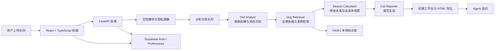

# 租房避坑局

> GitHub README 版本：面向开源展示、项目介绍和本地运行指引编写。

租房避坑局是一个面向租房合同审查的 AI 应用。它把一份复杂的租房合同拆成“条款风险、法律依据、费用核算、可读报告”四个部分，由多个 Agent 协同完成分析，帮助租客在签约前更快发现押金、水电费、违约责任、自动续约、隐私条款等常见风险。

这个项目不是一个单纯的聊天页面，而是一条完整的合同分析工作流：上传合同后，系统会解析文档内容，按步骤调用不同 Agent，实时展示分析进度，并在结果页中把风险条款、法律参考、费用异常和报告汇总到同一个工作台里。

## 核心能力

- 多格式合同上传：支持 `PDF`、`DOCX`、`PNG/JPG` 图片和文本类合同内容。
- 多 Agent 协作：`Owl` 识别条款风险，`Dog` 检索法律依据，`Beaver` 核算费用，`Cat` 汇总报告。
- RAG 知识检索：通过本地知识文件和 FAISS 向量索引检索租房法律、案例和水电价格信息。
- 实时分析进度：后端使用任务队列和 SSE，把每个 Agent 的执行状态推送到前端。
- 结果追问：分析完成后，可以围绕当前合同继续向 `Owl / Dog / Beaver` 追问。
- 报告导出：支持导出清洁版 HTML 报告和带标注的合同版本。
- 隐私保护：支持上传后自动脱敏手机号、身份证号、邮箱、银行卡号、主体名称等敏感信息。
- 阅后即焚：支持在退出登录或主动清理时删除当前用户的临时合同运行态。
- 用户系统：基于 Supabase 支持登录、合同历史、用户偏好和个性化风险阈值。

## 适用场景

- 租客签约前快速检查合同中可能不公平或不清晰的条款。
- 对押金、违约金、水电燃气、服务费等费用进行自动核算。
- 为租客和房东、中介沟通提供结构化的风险说明和协商依据。
- 作为多 Agent、RAG、文档解析和合同工作流类 AI 应用的参考实现。

## 系统架构



## Agent 设计

| Agent | 角色 | 主要输出 |
| --- | --- | --- |
| `Owl Analyst` | 条款解析师 | 合同实体、风险条款、风险等级、修改建议 |
| `Dog Retriever` | 法律检索师 | 法律条文、案例线索、条款适用说明 |
| `Beaver Calculator` | 费用计算师 | 押金合规性、水电费加价、隐藏费用、年度成本 |
| `Cat Reporter` | 报告整理师 | Markdown 报告、风险摘要、可读结论 |

整个分析链路不是把所有问题一次性丢给一个模型，而是把任务拆成更稳定的中间步骤。这样前端可以展示每个 Agent 的进度，后端也能在某一步失败时进行 fallback 或保留已有结果。

## 功能流程

```text
上传合同
-> 识别文件类型并解析文本
-> 可选隐私脱敏
-> 创建分析任务
-> Owl 提取实体并识别风险
-> Dog 检索法律与案例依据
-> Beaver 核算费用与隐藏成本
-> Cat 生成最终报告
-> 前端展示合同原文、风险卡片、报告和追问入口
```

## 技术栈

### 前端

- React 19
- TypeScript
- Vite
- Tailwind CSS 4
- Supabase JS
- lucide-react
- motion

### 后端

- Python 3.10+
- FastAPI
- Uvicorn
- Pydantic / pydantic-settings
- Supabase Python Client

### AI 与检索

- OpenAI-compatible API client
- Claude / Qwen / OpenAI 兼容模型配置
- FAISS
- sentence-transformers
- DashScope / OpenAI-compatible Embedding

### 文档处理

- pdfplumber
- PyPDF2
- python-docx
- Pillow
- PaddleOCR
- python-magic-bin

## 项目结构

```text
租房避坑局/
├─ src/                         # 前端应用
│  ├─ components/               # 页面组件、工作台、分析进度、用户偏好
│  ├─ services/                 # API、鉴权、导出、任务状态、错误处理
│  ├─ types/                    # 前端类型定义
│  ├─ uploadHelpers.ts          # 上传格式校验
│  ├─ App.tsx                   # 应用入口
│  └─ index.css                 # 全局样式
├─ backend/
│  ├─ src/
│  │  ├─ agents/                # Owl / Dog / Beaver / Cat / Agent Chat
│  │  ├─ database/              # Supabase 客户端封装
│  │  ├─ knowledge/             # RAG 数据加载、向量化、检索
│  │  ├─ models/                # Pydantic 数据模型
│  │  ├─ prompts/               # Agent 提示词
│  │  ├─ utils/                 # 文档解析、隐私脱敏、LLM 客户端等工具
│  │  ├─ analysis_queue.py      # 内存任务队列
│  │  ├─ analysis_queue_worker.py
│  │  ├─ analysis_runtime.py    # 多 Agent 编排
│  │  ├─ streaming.py           # SSE 事件封装
│  │  └─ main.py                # FastAPI 入口
│  ├─ database/                 # Supabase SQL 脚本
│  ├─ tests/                    # 后端测试
│  ├─ requirements.txt
│  └─ .env.example
├─ tests/                       # 前端回归脚本
├─ docs/plans/                  # 设计记录
├─ .env.example                 # 前端环境变量示例
├─ start-all.bat                # Windows 本地快速启动脚本
├─ package.json
└─ README.md
```

## 本地运行

### 环境要求

- Node.js 18+
- npm 9+
- Python 3.10+
- 可选：Supabase 项目，用于登录、历史记录和用户偏好
- 可选：DashScope / OpenAI-compatible Embedding，用于重建本地知识库

### 1. 克隆项目

```bash
git clone https://github.com/plutoljy/zufang-bikengju.git
cd 租房避坑局
```

### 2. 安装前端依赖

```bash
npm install
```

### 3. 安装后端依赖

```bash
cd backend
pip install -r requirements.txt
cd ..
```

### 4. 配置前端环境变量

复制 `.env.example` 为 `.env`，然后填入自己的 Supabase 配置。

```bash
cp .env.example .env
```

示例：

```env
VITE_SUPABASE_URL=https://your-project.supabase.co
VITE_SUPABASE_PUBLISHABLE_KEY=your-supabase-publishable-key
VITE_API_PORT=8000
```

### 5. 配置后端环境变量

复制 `backend/.env.example` 为 `backend/.env`，然后填入自己的模型、Embedding、Supabase 配置。

```bash
cp backend/.env.example backend/.env
```

示例：

```env
OPENAI_API_KEY=your-openai-api-key
OPENAI_BASE_URL=https://api.openai.com/v1
OPENAI_MODEL=gpt-5.4

QWEN_API_KEY=your-qwen-api-key
QWEN_BASE_URL=https://dashscope.aliyuncs.com/compatible-mode
QWEN_MODEL=qwen-max

CLAUDE_BASE_URL=https://your-relay.example.com
CLAUDE_API_KEY_OPUS=your-claude-opus-key
CLAUDE_MODEL_OPUS=claude-opus-4-6
CLAUDE_API_KEY_SONNET=your-claude-sonnet-key
CLAUDE_MODEL_SONNET=claude-sonnet-4-6
CLAUDE_API_KEY_BEAVER=your-beaver-dedicated-key

EMBEDDING_API_KEY=your-embedding-api-key
EMBEDDING_BASE_URL=https://dashscope.aliyuncs.com/compatible-mode/v1
EMBEDDING_MODEL=text-embedding-v1

JWT_SECRET_KEY=replace-with-a-random-secret

SUPABASE_URL=https://your-project.supabase.co
SUPABASE_KEY=your-supabase-anon-key
SUPABASE_SERVICE_ROLE_KEY=your-supabase-service-role-key
```

### 6. 启动后端

```bash
cd backend
python -m uvicorn src.main:app --reload --host 0.0.0.0 --port 8000
```

访问：

- API: `http://localhost:8000`
- Swagger: `http://localhost:8000/docs`

### 7. 启动前端

打开另一个终端，在项目根目录运行：

```bash
npm run dev
```

访问：

- Web App: `http://localhost:3000`

### 8. Windows 快速启动

Windows 环境可直接运行：

```bat
start-all.bat
```

脚本会分别启动后端 `8000` 端口和前端 `3000` 端口。使用前请确认系统命令行能直接访问 `python` 和 `npm`。

## 知识库与向量索引

本项目的 RAG 知识源位于：

```text
backend/src/knowledge/data/
```

当前主要包含租房法律、案例和水电价格相关文本。向量索引默认位于：

```text
backend/src/knowledge/vectorstore/
```

如果更新了知识文件，可以重新生成索引：

```bash
cd backend
python -m src.knowledge.vectorize
```

## 主要 API

### 合同分析

- `POST /api/contracts/upload`
- `GET /api/contracts/{contract_id}/analyze`
- `POST /api/contracts/{contract_id}/analyze/queue`
- `GET /api/analysis/tasks/{task_id}`
- `GET /api/analysis/tasks/{task_id}/stream`
- `GET /api/contracts/{contract_id}/report`

### 工作台

- `GET /api/contracts/history`
- `POST /api/contracts/{contract_id}/agents/{agent_key}/chat`
- `POST /api/contracts/burn-after-reading/cleanup`

### 用户偏好

- `GET /api/preferences/{user_id}`
- `POST /api/preferences/{user_id}`
- `DELETE /api/preferences/{user_id}`
- `POST /api/preferences/{user_id}/reset`

## 测试

### 前端类型检查与回归脚本

```bash
npm run lint
npx tsx tests/frontend_regressions.ts
npx tsx src/services/workspaceState.regression.ts
npx tsx src/services/analysisProgress.regression.ts
npx tsx src/services/analysisTaskRegistry.regression.ts
npx tsx src/services/exportHtml.regression.ts
```

### 后端测试

```bash
cd backend
pytest tests -q
python test_analysis_runtime_regressions.py
```

## 隐私与安全

- 仓库只应提交 `.env.example`，不要提交 `.env` 或 `backend/.env`。
- README 中所有密钥均为占位符，真实密钥只应保存在本地环境变量中。
- 如果真实密钥曾经进入过 Git 历史，建议立即轮换对应 API Key。
- 不建议上传真实合同、身份证照片、租客联系方式、付款截图或完整录屏。
- `SUPABASE_SERVICE_ROLE_KEY` 只允许后端使用，不要暴露到前端变量中。
- 当前合同分析状态主要保存在后端进程内存中，公开部署前应增加持久化存储、审计日志和限流策略。
